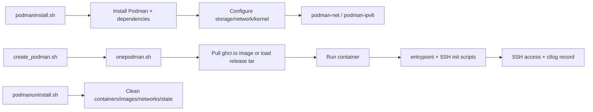

# podman

[](https://hits.spiritlhl.net/podman)

基于 Podman 的容器环境一键安装与管理脚本

支持一键安装 Podman 运行时，并开设基于本仓库编译镜像的各种 Linux 容器（提供 SSH 访问），支持 IPv6、端口映射、资源限制等。

## 说明

- 使用各发行版官方软件包安装 Podman（无守护进程，daemonless 架构）
- 使用本仓库自编译的基础镜像，优先从 ghcr.io 拉取，无法获取时回退到 GitHub Releases 离线包
- 支持系统：Ubuntu 22.04、Debian 12、Alpine、AlmaLinux 9、RockyLinux 9、OpenEuler 22.03
- 支持架构：amd64、arm64

## 快速开始

1. 以 root 用户登录目标机器。
2. 执行安装脚本：`bash <(wget -qO- https://raw.githubusercontent.com/oneclickvirt/podman/main/podmaninstall.sh)`。
3. 创建容器：`./onepodman.sh ct1 1 512 MyPassword 25000 34975 35000 n debian 0`。
4. 连接 SSH：`ssh root@<服务器IP> -p 25000`。
5. 查看记录：`cat ctlog` 或 `podman ps -a`。

## 架构



## 安装 Podman 环境

```bash
bash <(wget -qO- https://raw.githubusercontent.com/oneclickvirt/podman/main/podmaninstall.sh)
```

无交互安装可使用：

```bash
export noninteractive=true
bash <(wget -qO- https://raw.githubusercontent.com/oneclickvirt/podman/main/podmaninstall.sh)
```

可选环境变量：

| 变量 | 说明 | 默认值 |
|------|------|--------|
| noninteractive | 设为 true 时跳过所有交互提示 | false |
| WITHOUTCDN | 设为 true 时禁用 CDN 探测与加速 | false |
| NEED_DISK_LIMIT | 是否启用 btrfs 容器磁盘限制 | n |
| PODMAN_INSTALL_PATH | Root Podman 存储路径，会写入 `storage.conf` 的 `graphroot` | /var/lib/containers/storage |
| PODMAN_POOL_SIZE | btrfs loop 存储池大小 GB | 20 |
| PODMAN_LOOP_FILE | btrfs loop 镜像文件路径 | /opt/podman-pool.img |
| PODMAN_ROOTLESS_USER | 安装阶段为指定用户配置 rootless Podman 的 subuid/subgid | 空 |
| PODMAN_ROOTLESS_CREATE_USER | 配合 PODMAN_ROOTLESS_USER 自动创建缺失用户 | false |
| PODMAN_ROOTLESS_SUBUID_START | rootless subuid 起始值 | 100000 |
| PODMAN_ROOTLESS_SUBGID_START | rootless subgid 起始值 | 100000 |

## 开设单个容器

```bash
# 下载脚本
wget -q https://raw.githubusercontent.com/oneclickvirt/podman/main/scripts/onepodman.sh
chmod +x onepodman.sh

# 用法:
# ./onepodman.sh <name> <cpu> <memory_mb> <password> <sshport> <startport> <endport> [ipv6:y/n] [system] [disk_gb]
# 需要自动生成密码但仍传后续端口参数时，将 <password> 传为空字符串 ""

# 示例: 创建名为 ct1 的 Debian 容器，1核 512MB，SSH端口25000，额外端口34975-35000
./onepodman.sh ct1 1 512 MyPassword 25000 34975 35000 n debian 0
```

| 参数 | 说明 | 默认值 |
|------|------|--------|
| name | 容器名称 | test |
| cpu | CPU 核数（支持 0.5 等） | 1 |
| memory_mb | 内存限制（MB） | 512 |
| password | root 密码，未提供或传空字符串时自动生成 | 自动生成 |
| sshport | SSH 端口（宿主机→容器 22） | 25000 |
| startport | 公网端口范围起始 | 34975 |
| endport | 公网端口范围结束 | 35000 |
| ipv6 | 是否分配独立 IPv6（y/n） | n |
| system | 镜像系统 | debian |
| disk_gb | 磁盘限制 GB（0=不限制） | 0 |

SSH 宿主机端口不能落在额外公网端口范围内，避免同一个宿主端口被重复映射。

**支持的 system 参数：** `ubuntu` / `debian` / `alpine` / `almalinux` / `rockylinux` / `openeuler`

也支持带版本号或常见别名的写法，会自动规范化到本项目实际镜像 tag，例如：
`ubuntu22`、`ubuntu/22.04` -> `ubuntu`；`debian12`、`debian/12` -> `debian`；
`alma9`、`almalinux/9` -> `almalinux`；`rocky9`、`rockylinux/9` -> `rockylinux`；
`openeuler22.03`、`openeuler/22.03` -> `openeuler`。不存在的版本不会静默降级。

## 批量开设容器

```bash
wget -q https://raw.githubusercontent.com/oneclickvirt/podman/main/scripts/create_podman.sh
chmod +x create_podman.sh
./create_podman.sh
```

交互式脚本，自动递增容器名（ct1, ct2, ...）、SSH 端口、公网端口，容器信息记录到 `ctlog` 文件。

无交互批量创建示例：

```bash
export noninteractive=true
export PODMAN_CREATE_COUNT=3
export PODMAN_MEMORY_MB=512
export PODMAN_CPU=1
export PODMAN_SYSTEM=debian
export PODMAN_IPV6=n
./create_podman.sh
```

批量创建时支持的环境变量：

| 变量 | 说明 | 默认值 |
|------|------|--------|
| PODMAN_CREATE_COUNT | 新增容器数量，也兼容 PODMAN_CREATE_NUMS | 1 |
| PODMAN_MEMORY_MB | 每个容器内存 MB | 512 |
| PODMAN_CPU | 每个容器 CPU 核数 | 1 |
| PODMAN_DISK_GB | 每个容器磁盘限制 GB，仅 btrfs 可用 | 0 |
| PODMAN_SYSTEM | 容器系统，支持 `debian12`/`debian/12` 等版本别名 | debian |
| PODMAN_IPV6 | 是否分配独立 IPv6 | n |
| PODMAN_CONTAINER_PREFIX | 容器名前缀 | ct |
| PODMAN_CONTAINER_START_NUM | 第一个容器编号 | 从 ctlog 续接 |
| PODMAN_START_SSH_PORT | 第一个 SSH 宿主机端口 | 从 ctlog 续接 |
| PODMAN_PUBLIC_PORT_START | 第一个公网映射端口 | 从 ctlog 续接 |

其他环境变量：

| 变量 | 说明 | 默认值 |
|------|------|--------|
| FORCE_UNINSTALL | 兼容旧版的一键卸载确认跳过开关 | false |
| ROOT_PASSWORD | 容器 entrypoint 内部读取的 root 密码 | 由创建脚本传入 |
| IPV6_ENABLED | 容器运行时内部标记，用于 IPv6 模式 | false |
| PODMAN_SKIP_RESOURCE_CHECK | 批量创建调用 onepodman.sh 时使用，避免重复资源扫描 | false |
| PODMAN_BATCH_MODE | 批量创建时保留同名临时记录文件供 create_podman.sh 消费 | false |
| PODMAN_ROOTLESS | 非 root 用户运行 onepodman.sh/create_podman.sh 的显式开关 | false |
| PODMAN_WORKDIR | rootless 批量创建时 ctlog 的工作目录 | 当前目录 |
| PODMAN_SCRIPT_DIR | rootless 批量创建时缓存 onepodman.sh 的脚本目录 | `$HOME/.local/share/oneclickvirt-podman/scripts` |
| PODMAN_RELEASE_BASE_URL | Releases 离线包基础地址，格式为 `<base>/<system>/<tar.gz>` | GitHub Releases |
| PODMAN_GHCR_IMAGE | GHCR 镜像仓库前缀 | ghcr.io/oneclickvirt/podman |
| PODMAN_SCRIPT_BASE_URL | SSH 初始化脚本和 onepodman.sh 下载基础地址 | GitHub raw scripts |
| PODMAN_POD_NAME | 将容器放入指定 Podman pod，端口映射挂在 pod 上 | 空 |
| PODMAN_POD_JOIN_EXISTING | 允许加入已存在 pod，需自行避免共享网络命名空间内端口冲突 | false |

单容器创建默认会把容器记录追加到 `ctlog`。批量创建会临时生成同名记录文件，追加到 `ctlog` 后立即删除，避免长期留下包含密码的散落文件。

Rootless 创建示例：

```bash
export PODMAN_ROOTLESS=true
./onepodman.sh ct1 1 512 "" 25000 34975 35000 n debian 0
```

Pod 网络示例：

```bash
export PODMAN_POD_NAME=ctpod1
./onepodman.sh ct1 1 512 "" 25000 34975 35000 n debian 0
```

批量创建时如果设置 `PODMAN_POD_NAME` 且未设置 `PODMAN_POD_JOIN_EXISTING=true`，脚本会按容器名自动派生 pod 名，避免多个 SSH 容器无意共享同一个网络命名空间。

## 查看与管理容器

```bash
podman ps -a                  # 查看所有容器
podman exec -it <name> bash   # 进入容器（bash 系统）
podman exec -it <name> sh     # 进入容器（alpine）
podman logs <name>            # 查看容器日志
podman rm -f <name>           # 删除单个容器
podman images                 # 查看所有镜像
podman rmi <image>            # 删除镜像
```

## 卸载（完整清理）

一键卸载 Podman 全套环境，包括所有容器、镜像、网络、辅助文件：

```bash
bash <(wget -qO- https://raw.githubusercontent.com/oneclickvirt/podman/main/podmanuninstall.sh)
```

脚本会在执行前要求输入 `yes` 确认，操作不可逆。无交互卸载可先执行 `export noninteractive=true`，也兼容 `FORCE_UNINSTALL=true`。

## 镜像说明

本仓库自编镜像通过 GitHub Actions 使用 Podman/Buildah 构建，发布到 Releases 及 ghcr.io：

| 系统 | amd64 | arm64 |
|------|-------|-------|
| Ubuntu 22.04 | spiritlhl_ubuntu_amd64.tar.gz | spiritlhl_ubuntu_arm64.tar.gz |
| Debian 12 | spiritlhl_debian_amd64.tar.gz | spiritlhl_debian_arm64.tar.gz |
| Alpine latest | spiritlhl_alpine_amd64.tar.gz | spiritlhl_alpine_arm64.tar.gz |
| AlmaLinux 9 | spiritlhl_almalinux_amd64.tar.gz | spiritlhl_almalinux_arm64.tar.gz |
| RockyLinux 9 | spiritlhl_rockylinux_amd64.tar.gz | spiritlhl_rockylinux_arm64.tar.gz |
| OpenEuler 22.03 | spiritlhl_openeuler_amd64.tar.gz | spiritlhl_openeuler_arm64.tar.gz |

同时推送至 ghcr.io，支持 multi-arch manifest：
- `ghcr.io/oneclickvirt/podman:<os>-amd64`
- `ghcr.io/oneclickvirt/podman:<os>-arm64`
- `ghcr.io/oneclickvirt/podman:<os>`（multi-arch manifest list）

创建容器时会优先拉取 `PODMAN_GHCR_IMAGE:<os>-<arch>`，拉取失败后再下载 `PODMAN_RELEASE_BASE_URL/<os>/spiritlhl_<os>_<arch>.tar.gz` 并加载为本地镜像。

## 网络说明

- IPv4 网络名: `podman-net`，bridge: `podman-br0`，subnet: `172.20.0.0/16`
- IPv6 双栈网络名: `podman-ipv6`，bridge: `podman-br1`，包含 172.21.0.0/16 + 公网 IPv6 /80 子网
- 与 containerd/docker 版本完全隔离，互不干扰

## 与 containerd/docker 版本对比

| 特性 | 本项目（Podman） | oneclickvirt/containerd | oneclickvirt/docker |
|------|----------------|------------------------|---------------------|
| 守护进程 | 无（daemonless） | containerd | Docker daemon |
| 运行时 | crun/runc | runc | runc |
| rootless 支持 | 原生支持 | 不支持 | 需配置 |
| 镜像格式 | OCI | OCI | OCI |
| 网络后端 | netavark/CNI | CNI | Docker bridge |
| 构建工具 | Buildah/podman-build | buildkitd | Docker buildx |
| 安装方式 | 系统包管理器 | nerdctl-full bundle | Docker 官方脚本 |
